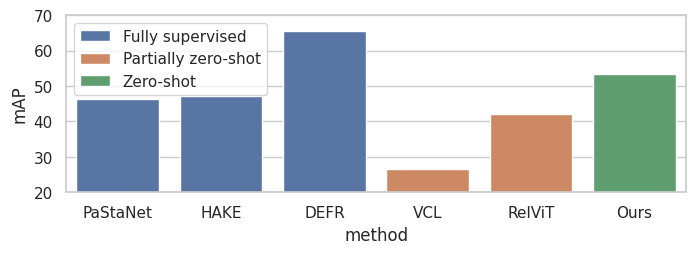
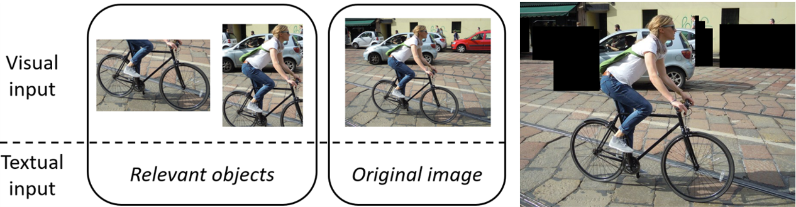
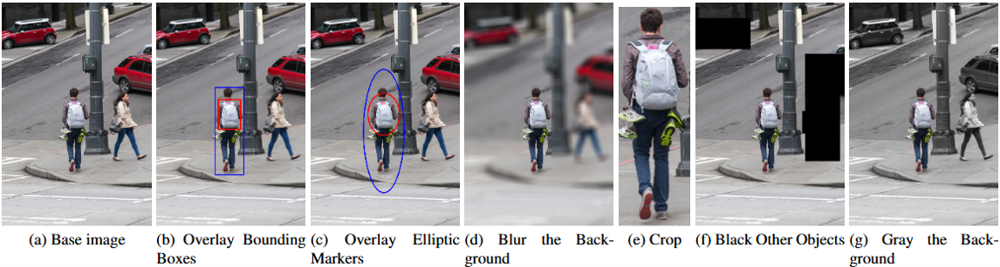

# Multimodal large Language Models for Zero-Shot Human-Object Interaction

## 📄 Paper
This repository contains the code and resources related to the paper:  

**[Full Paper Title]**  
[Author(s)]  
[Conference/Journal Name, Year]  
[Link to paper (arXiv, DOI, or conference page)]  

If you find this work useful, please cite it using the reference below.  

## 📌 Abstract
Multimodal Large Language Models (MLLMs) excel as zero-shot reasoners across diverse domains. However, their application to real-world classification tasks, particularly in direct comparison with specialized models, remains underexplored. This work explores how MLLMs can be leveraged for zero-shot Human-Object Interaction (HOI) recognition and detection using token probability outputs. We first benchmark lightweight MLLMs, identifying Qwen2-VL and MiniCPM-V as the most effective families. We then propose a comprehensive taxonomy of zero-shot strategies, integrating textual prompting methods and visual prompting techniques. For HOI detection, we develop Objects as In-Context Learning (ICL) and Black Other Objects methods for object specification. Evaluations on HICO dataset reveal that Objects as ICL boosts performance for multi-image-capable MLLMs, while ensembling text prompts enhances robustness. On HICO-DET, Objects as ICL, Black Other Objects, and Blur the Background emerge as superior visual prompting methods for localization. Our approach achieves 53.50 mAP on HICO and 23.69 mAP on HICO-DET, outperforming prior zero-shot methods and approaching the performance of certain supervised models.

## 📂 Repository Structure
```
├── datasets/ # Code to preprocess the data used in the paper
    └── hico
        └── annotations
    └── hico_det
        └── annotations
├── src/ # Source code for experiments
    └── evaluations
        └── hico
            └── results
        └── hico_det
            └── results
    └── models # MLLMs supported
├── images/ # Images of the README.md file
├── requirements.txt # Dependencies
├── README.md # This file
├── LICENSE # License file
```

## 🔧 Installation
Clone the repository and install dependencies:
```
git clone https://github.com/oriol-rabasseda/mllms-zs-hoi.git
cd mllms-zs-hoi
pip install -r requirements.txt
```

To use the FLOP estimator tool of MLLMs, please refer to https://github.com/oriol-rabasseda/vlm-complexity-calculation.

## 📥 Dataset Download
The datasets used in this paper can be downloaded from: https://umich-ywchao-hico.github.io/. HICO version is 20150920 and HICO-DET version is 20160224.

After downloading, unzip and place the dataset in `<your-data>` directory.

### HICO pre-processing
Run the script:
```
cd datasets/hico
./build_hico.sh <your-data>/hico_20150920/anno.mat <your-data>/hico_20150920/images/test2015 <mode> <model>
```
where `<mode>` should be substitued by `OD`, `GT`, or `MLLM` depending on the strategy used to filter out questions whose objects are not in the scene:
* `OD`: Use YOLO11x to filter the objects in the scene with a confidence score lower than 0.1.
* `GT`: Use the ground truth objects in the scene, evaluating the Known Objects approach of HICO.
* `MLLM`: Use a MLLM with the question `Is there a <object> in the image? Answer with yes or no.` and compute the classification score to determine the presence of the `<object>` in the scene. The detection score is set to 0.5. This strategy requires the parameter `<model>` with a supported model, that will be used for detection.

To construct the JSON file for the ensemble of prompts, the command is equivalent swapping `./build_hico.sh` for `./build_hico_ensemble.sh` and inserting as 4th argument the number of templates.

### HICO-DET pre-processing
Run the script:
```
cd datasets/hico_det
python possible_questions.py
```

Similar for `possible_questions_bbox`, `possible_questions_blur`, `possible_questions_gray`, and `possible_questions_marker`.

## 🏗️ Usage
### HICO evaluation
For the baseline computation, run the script:
```
cd src/evaluations/hico
python evaluate_hico_classification.py --model-name <model> --img-dir <your-data>/hico_20150920/images/test2015 --qa-filepath ../../../datasets/hico/annotations/hico_qa_test_unknown_od.json --output-filepath ./results/<model>.json
```

`<model>` must be subtituted by one model belonging to one of the supported families of models: MiniCPM-V ([🤗](https://huggingface.co/collections/openbmb/multimodal-models-65d48fa84e358ce02a92d004)), Qwen2-VL ([🤗](https://huggingface.co/collections/Qwen/qwen2-vl-66cee7455501d7126940800d)), Qwen2.5-VL ([🤗](https://huggingface.co/collections/Qwen/qwen25-vl-6795ffac22b334a837c0f9a5)), LLaVA-OneVision ([🤗](https://huggingface.co/collections/llava-hf/llava-onevision-66bb1e9ce8856e210a7ed1fe)), InternVL2 ([🤗](https://huggingface.co/collections/OpenGVLab/internvl20-667d3961ab5eb12c7ed1463e)), InternVL2.5 ([🤗](https://huggingface.co/collections/OpenGVLab/internvl25-673e1019b66e2218f68d7c1c)), InternVL2.5-MPO ([🤗](https://huggingface.co/collections/OpenGVLab/internvl25-mpo-6753fed98cd828219b12f849)), Phi-3-Vision ([🤗](https://huggingface.co/collections/microsoft/phi-3-6626e15e9585a200d2d761e3)), Ovis2 ([🤗](https://huggingface.co/collections/AIDC-AI/ovis2-67ab36c7e497429034874464)), and Deepseek-VL2 ([🤗](https://huggingface.co/collections/deepseek-ai/deepseek-vl2-675c22accc456d3beb4613ab)).

For evaluations applying zero-shot strategies
```
cd src/evaluations/hico
python evaluate_hico_<method>.py --model-name <model> --img-dir <your-data>/hico_20150920/images/test2015 --qa-filepath ../../../datasets/hico/annotations/hico_qa_test_unknown_od.json --output-filepath ./results/<method>/<model>.json
```

where `<method>` can be `caption`, `cot`, or `objects_icl`; and `<model>` supported are MiniCPM-V and Qwen2-VL families. For ensemble methods, run the script:
```
cd src/evaluations/hico
python evaluate_hico_ensemble.py --model-name <model> --img-dir <your-data>/hico_20150920/images/test2015 --qa-filepath ../../../datasets/hico/annotations/Ensemble/<num_templates>/hico_qa_test_unknown_od.json --output-filepath ./results/Ensemble/<num_templates>/<model>.json
```

To evaluate the results obtained by an experiment, run:
```
cd src/evaluations/hico
python map.py --model-name <model> --results-filepath ./results/<model>.json
```

### HICO-DET evaluation
For Unknown setting computation, run the script:
```
cd src/evaluations/hico_det
python evaluate_hico_det.py --model-name <model> --img-dir <your-data>/hico_20160224_det/images/test2015 --gt-filepath ../../../datasets/hico_det/gt.json --q-hoi-filepath ../../../datasets/hico_det/annotations/questions_per_hoi_<method>.json --output-filepath ./results/<model>_<method>.json --mode <method> --save-folderpath <your-data>/<method>/
```

where:
* `--model-name`: The Hugging Face identifier of the model. Supported models are the same as HICO.
* `--img-dir`: Folder directory where the images of HICO-DET are located.
* `--gt-filepath`: Folder containing the ground truth detections. Only used for the list of images.
* `--q-hoi-filepath`: JSON file with the list of questions depending on the HOI. This list should be changed based on the specification method used.
* `--output-filepath`: Dump the predictions to the specified file.
* `--mode`: Specification method used. Possibilites are `Baseline`, `Bboxes`, `Crop`, `Blur`, `Context`, `Gray`, `Black`, `Marker`, `Text_center`, `Text_boundary`, `Crop_black`, `Crop_blur`, and `Crop_context`. Default is `Baseline` (no specification method).
* `--save-folderpath`: Folder to save the modified images in the specification cases that use visual input methods.

For the executions using the ground truth bounding boxes (treating the problem as a classification problem with different object specification approaches), run the script:
```
cd src/evaluations/hico_det
python evaluate_hico_det_gt_od.py --model-name <model> --img-dir <your-data>/hico_20160224_det/images/test2015 --gt-filepath ../../../datasets/hico_det/gt.json --q-hoi-filepath ../../../datasets/hico_det/annotations/questions_per_hoi_<method>.json --output-filepath ./results/<model>_<method>_gt.json --mode <method> --save-folderpath <your-data>/<method>/
```

where all parameters are equivalent to the default computation. To evaluate the performance of an experiment, run:
```
cd src/evaluations/hico_det
python map_bbox.py --results-filepath ./results/<model>_<method>.json --gt-filepath ../../../datasets/hico_det/gt.json
```

## 📊 Results
### HOI recognition
Our zero-shot approach leveraging MLLMs obtain superior results on HICO compared to partially zero-shot approaches.


Computed results on HICO depending on the MLLM are:
| Model                          | mAP    |
| ------------------------------ | ------ |
| MiniCPM-V                      | 48.20% |
| MiniCPM-V 2                    | 47.48% |
| InternVL2-1B                   | 40.58% |
| InternVL2-2B                   | 38.64% |
| Qwen2-VL 2B                    | 51.39% |
| Qwen2-VL 7B                    | 52.89% |
| LLaVA-OneVision 0.5B (OV)      | 46.15% |
| LLaVA-OneVision 0.5B (SI)      | 44.61% |
| Phi 3.5 Vision                 | 40.44% |
| InternVL2.5-1B                 | 41.81% |
| InternVL2.5-2B                 | 43.48% |
| Ovis2-1B                       | 11.74% |
| Ovis2-2B                       | 11.93% |
| Qwen2.5-VL 3B                  | 45.67% |
| InternVL2.5-1B MPO             | 41.82% |
| InternVL2.5-2B MPO             | 12.22% |
| DeepSeek-VL2 Tiny              | 44.13% |

### HOI detection
For object specification, we design Black Other Objects and Objects as In-Context Learning (ICL):


The remaining object specification methods are:


On HICO-DET, the comparison of methods return the following results:
| Approach                     | mAP (MiniCPM-V) | mAP (Qwen2-VL) |
| ---------------------------- | ------ | ------ |
| Baseline                     | 20.78% | 20.00% |
| Objects as ICL               | 22.17% | 20.56% |
| Overlay Bounding Boxes       | 15.90% | 19.41% |
| Crop                         | 20.96% | 18.46% |
| Blur the Background          | 22.45% | 23.69% |
| Gray the Background          | 19.59% | 19.65% |
| Black Other Objects          | 22.43% | 23.01% |
| Center Textual Coordinates   | 13.84% | 12.84% |
| Boundary Textual Coordinates | 15.41% | 15.76% |
| Overlay Elliptic Markers     | 17.70% | 19.86% |
| Crop + Black Other Objects   | 21.99% | 21.34% |
| Crop + Blur the Background   | 23.04% | 23.90% |
| Crop + Context as ICL        | 21.90% | 20.53% |

## 📜 Citation
If you use this work, please cite:

@article{YourCitationKey,
  author    = {Author Name(s)},
  title     = {Paper Title},
  journal   = {Journal/Conference Name},
  year      = {YYYY},
  volume    = {XX},
  number    = {X},
  pages     = {XX-XX},
  doi       = {DOI or link}
}
